# Project LEMP - Ubuntu Server Setup

## Overview
This project demonstrates the setup of a complete LEMP (Linux, Nginx, MySQL, PHP) stack on Ubuntu Server with a custom server block configuration.

## Prerequisites
- Ubuntu Server (tested on Ubuntu 20.04/22.04)
- Root or sudo access
- Basic command line knowledge

First create an Ubuntu instance:

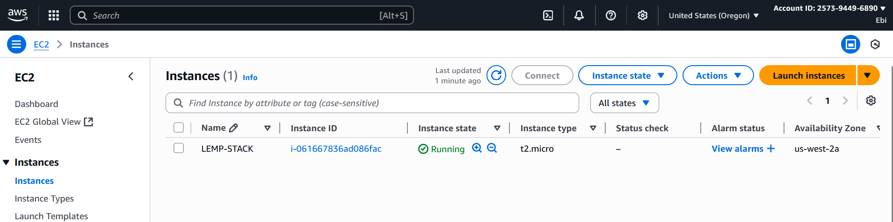

## Installation Steps

### 1. Update System
```bash
sudo apt update && sudo apt upgrade -y
```

### 2. Install Nginx
```bash
# Install Nginx
sudo apt install nginx -y

# Start and enable Nginx
sudo systemctl start nginx
sudo systemctl enable nginx

# Check status
sudo systemctl status nginx
```

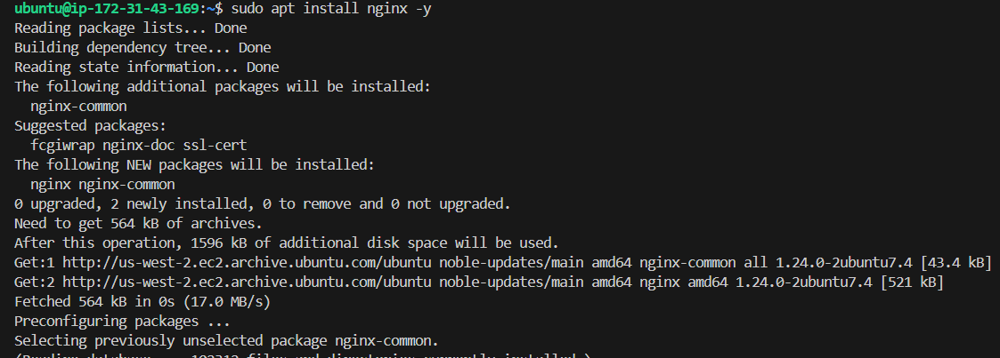

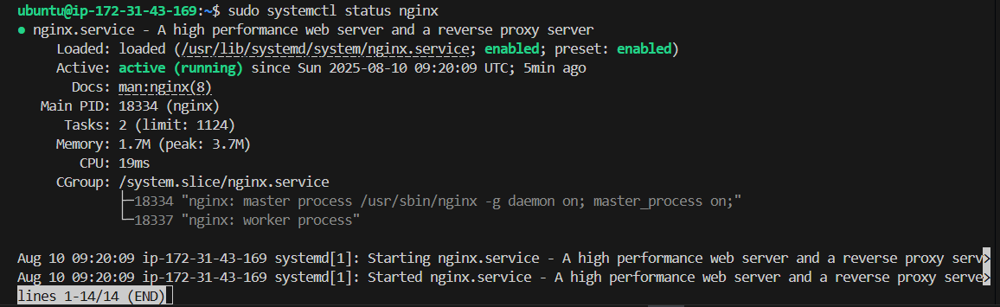

Test Nginx in browser: `http://your-server-ip`

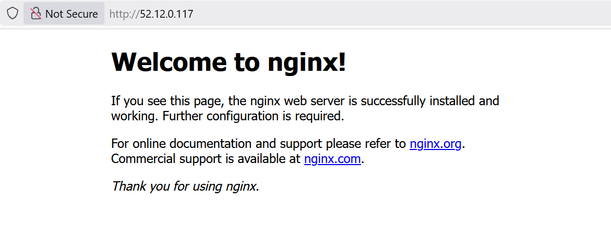

### 3. Install MySQL
```bash
# Install MySQL
sudo apt install mysql-server -y

# Secure installation
sudo mysql_secure_installation
```

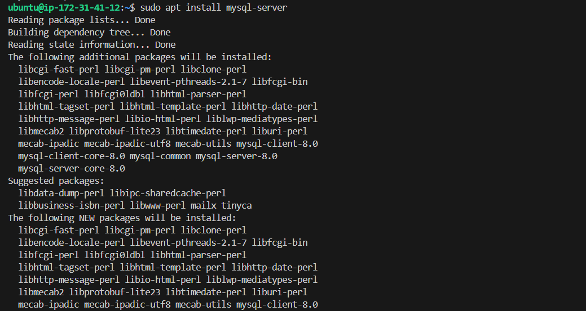

```bash
# Login and set root password
sudo mysql
ALTER USER 'root'@'localhost' IDENTIFIED WITH mysql_native_password BY 'your_password';
FLUSH PRIVILEGES;
EXIT;
```

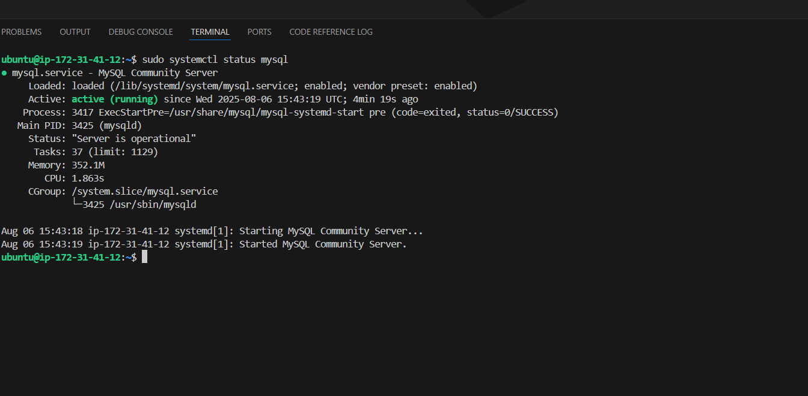

### 4. Install PHP
```bash
# Install PHP and required modules
sudo apt install php-fpm php-mysql php-curl php-json php-mbstring -y

# Check PHP version
php -v

# Check PHP-FPM status
sudo systemctl status php8.1-fpm
```

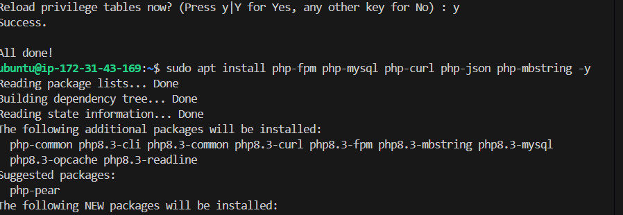

### 5. Configure Nginx for PHP
```bash
# Create project directory
sudo mkdir -p /var/www/projectlemp

# Set ownership
sudo chown -R $USER:$USER /var/www/projectlemp

# Create Nginx server block
sudo nano /etc/nginx/sites-available/projectlemp
```

Add this configuration:
```nginx
server {
    listen 80;
    server_name projectlemp www.projectlemp;
    root /var/www/projectlemp;

    index index.html index.htm index.php;

    location / {
        try_files $uri $uri/ =404;
    }

    location ~ \.php$ {
        include snippets/fastcgi-php.conf;
        fastcgi_pass unix:/var/run/php/php8.1-fpm.sock;
    }

    location ~ /\.ht {
        deny all;
    }
}
```

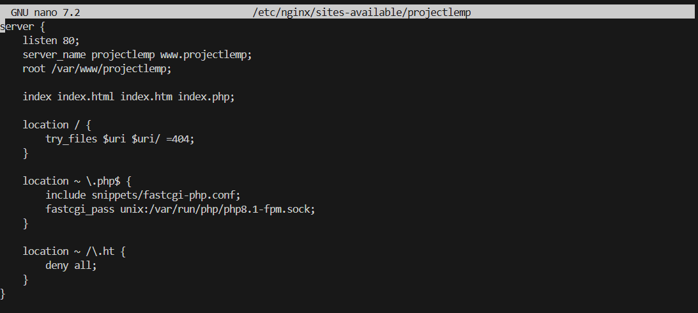

### 6. Enable Site
```bash
# Enable the site
sudo ln -s /etc/nginx/sites-available/projectlemp /etc/nginx/sites-enabled/

# Disable default site
sudo unlink /etc/nginx/sites-enabled/default

# Test configuration
sudo nginx -t

# Restart Nginx
sudo systemctl restart nginx
```

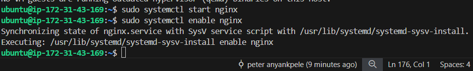

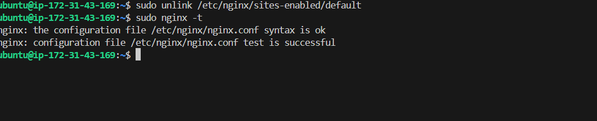

### 7. Test Setup
```bash
# Create test HTML file
echo "<h1>LEMP Stack Works!</h1>" | sudo tee /var/www/projectlemp/index.html

# Create PHP info file
echo "<?php phpinfo(); ?>" | sudo tee /var/www/projectlemp/info.php
```

Test in browser:
- `http://your-server-ip` (should show HTML)
- `http://your-server-ip/info.php` (should show PHP info)

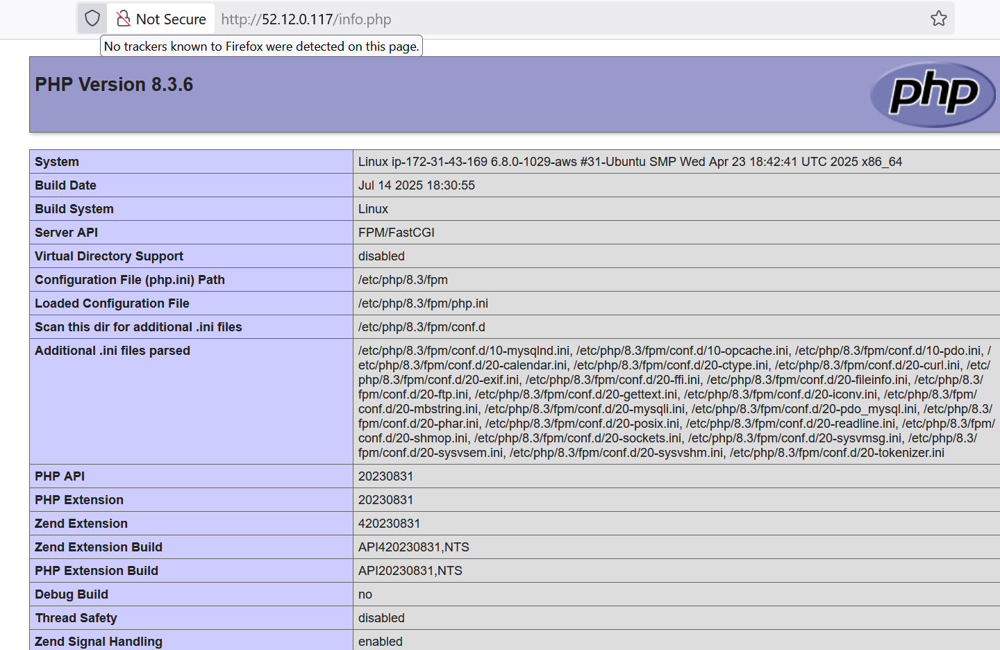

## Project Structure
```
/var/www/projectlemp/
├── index.html         # Test HTML page
└── [future files]     # Additional project files
```

## Troubleshooting

### Common Issues
1. **502 Bad Gateway**: Check PHP-FPM service status
2. **403 Forbidden Error**: Check file permissions and directory access
3. **Nginx Configuration Error**: Run `sudo nginx -t`
4. **MySQL Connection Issues**: Verify MySQL service and credentials

### Useful Commands
```bash
# Check Nginx error logs
sudo tail -f /var/log/nginx/error.log

# Check PHP-FPM logs
sudo tail -f /var/log/php8.1-fpm.log

# Restart services
sudo systemctl restart nginx
sudo systemctl restart mysql
sudo systemctl restart php8.1-fpm

# Test Nginx configuration
sudo nginx -t
```

## Security Considerations
- Remove PHP info files after testing
- Configure firewall (UFW)
- Set up SSL/HTTPS certificates
- Regular security updates

## Next Steps
- Install additional PHP modules as needed
- Set up SSL/HTTPS configuration
- Configure database for web applications
- Deploy actual web application files
- Set up monitoring and logging

## Author
Peter Anyankpele

## License
This project is for educational purposes.